<h1 align="center">Hi, I'm Vishnujan Narayanan</h1>

  <b>Data engineering · web scraping · full-stack · DevOps &amp; cloud</b> 
  I build the crawlers and pipelines that produce data, the services that expose it,
  and the infrastructure that keeps both running — with machine learning where it earns its place.

  <!-- shields.io no longer ships a LinkedIn icon, so the logo is inlined as a base64 data URI. -->
  
  
  
  

---

### About me

- I build **data collection at scale** — headless browser crawlers behind job queues, with caching, retries, and schema-checked writes into Postgres.
- I do the **data engineering** around it: ingesting from APIs and market feeds, reshaping it into something queryable, and scheduling the jobs that keep it fresh.
- I ship it **full-stack** — REST APIs, background workers, WebSocket progress, and the React front-ends that make it usable.
- I handle the **DevOps**: containerised services, CI that builds and deploys on push, and cloud storage and hosting behind it.
- I use **machine learning** where it earns its place — classification and regression on tabular data, text, and images, including work on heavily imbalanced datasets and financial time series.
- Reach me at **narayanan.vishnujan@gmail.com**

---

### Tech Stack

**Languages**

**Backend & Frontend**

**Infrastructure & Deployment**

**Machine Learning & Data**

---

### Contribution History

  <picture>
    <source media="(prefers-color-scheme: dark)" srcset="assets/contributions-dark.svg" />
    
  </picture>

> Generated from the GitHub API by [`scripts/generate_cards.py`](scripts/generate_cards.py) and refreshed
> daily by [`.github/workflows/cards.yml`](.github/workflows/cards.yml) — no third-party image service to go offline.

---

### Featured Projects

<table>
<tr>
<td width="50%" valign="top">

#### [Trader Sentiment Analysis](https://github.com/VishnujanNarayanan/Trader_sentiment_analysis)
Data-driven analysis of trader behavior against the **Bitcoin Fear & Greed Index** to validate sentiment-based trading strategies.

`Jupyter` `pandas` `Quant Research`

</td>
<td width="50%" valign="top">

#### [Neural Net from Scratch](https://github.com/VishnujanNarayanan/Neural_net_from_scratch)
A neural network built with **pure NumPy** — forward pass, backprop, and gradient descent hand-rolled — to detect breast cancer.

`NumPy` `Deep Learning` `From Scratch`

</td>
</tr>
<tr>
<td width="50%" valign="top">

#### [Linear Regression from Scratch](https://github.com/VishnujanNarayanan/Linear_regression_from_scratch)
Gradient descent, cost surfaces, and closed-form solutions implemented with **only NumPy** — no scikit-learn.

`NumPy` `Optimization` `Math`

</td>
<td width="50%" valign="top">

#### [Fraud Detection](https://github.com/VishnujanNarayanan/fraud_detection)
Detecting fraudulent transactions on heavily **imbalanced data** with feature engineering and classification models.

`scikit-learn` `Imbalanced Data`

</td>
</tr>
<tr>
<td width="50%" valign="top">

#### [TradingAgents](https://github.com/VishnujanNarayanan/TradingAgents)
Multi-agent **LLM financial trading framework** — specialised agents debating and executing market decisions.

`LLM Agents` `Python` `Finance`

</td>
<td width="50%" valign="top">

#### [Binance Futures Trading Bot](https://github.com/VishnujanNarayanan/binance-futures-trading-bot)
Automated futures trading bot with strategy execution and risk controls against the Binance API.

`Python` `API` `Automation`

</td>
</tr>
<tr>
<td width="50%" valign="top">

#### [Ticket Classifier (NLP)](https://github.com/VishnujanNarayanan/ticket-classifier-nlp)
Support-ticket triage using **NLP + ML** — text vectorisation through to multi-class routing.

`NLP` `scikit-learn`

</td>
<td width="50%" valign="top">

#### [Product Explorer](https://github.com/VishnujanNarayanan/product-explorer)
Full-stack **TypeScript** product browsing app — the front-end side of shipping data work as a product.

`TypeScript` `React`

</td>
</tr>
<tr>
<td width="50%" valign="top">

#### [Age & Gender Image Classifier](https://github.com/VishnujanNarayanan/Image_classifier)
CNN-based facial image classification predicting **age bracket and gender**.

`TensorFlow` `Computer Vision`

</td>
<td width="50%" valign="top">

#### [Quotes Retrieval](https://github.com/VishnujanNarayanan/Quotes_Retrieval)
Retrieval system for famous quotes — semantic search over a curated corpus.

`Python` `Retrieval`

</td>
</tr>
</table>

  

---

  <i>Always learning. Always shipping.</i>

